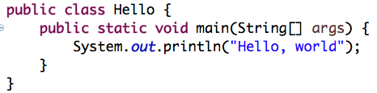

# 
# 1 - Java review
<p align='center'>
CodeSquad Master <br>
Hoyoung Jung
</p>

---
<!-- page_number: true -->
# 자바
- 썬의 제임스 고슬링이 만듬
- C 스타일 언어 
- 복잡한 기능 제거
- 객체 지향: 대규모 설계, 유지보수를 쉽게 
- 포인터는 사라지고 참조가 등장 
- 자동으로 가비지 컬렉션 수행

---
# Hello.java

```
$ javac Hello.java
$ java Hello
```

---
## Hello.java

- 파일명이 `MyClass.java`라면 `public class MyClass`를 반드시 포함할 것 
- main() 메소드: 진입점(엔트리 포인트)이 됨

---
## Primitive Data Type
- byte, short, int, long, float, double
- boolean
- char

## String  
- 클래스이지만 primitive와 유사
- immutable

## 기본값
- 초기화를 하지 않았을 때의 값
## 리터럴
> 1, true, 'A', "A"

---
## if
## for
## while
## switch-case

---
## method ( = function )
## return 키워드의 의미 
- 반환값
- 함수실행을 중단하고 빠져나옴 
- return 값이 없을 경우 return type은 `void`가 됨

---
# 클래스와 오브젝트
## 오브젝트
- state 와 behavior가 있는 소프트웨어 꾸러미  
- state = 변수
- behavior = 메소드 (함수)
- 인스턴스라는 단어와 혼용해서 사용

## 클래스
- user defined data type with behavior
- **오브젝트는 클래스로부터 생성됨**
- `new` 키워드를 이용해서 오브젝트 생성

---

## 생성자
- 인스턴스를 만들 때 사용하는 특별한 메소드 
- 리턴 타입이 없고 클래스와 같은 이름을 가짐

```java
public class People {
    //constructor
    public People(int name) {
    //...
    }
}
```

---

## public, private

- 접근 한정자 
- 메소드와 변수의 접근 범위 제어 
- public으로 선언하면 외부에서 접근 가능
- private은 내부에서만 사용 가능 

## static 키워드 
- 변수와 메소드 앞에 사용 가능 
- 
---
# 멤버 변수
## 인스턴스 변수
- 인스턴스 각각이 개별적으로 값을 가짐 
## 클래스 변수
- static 변수 
- 모든 클래스의 인스턴스들이 값을 공유함
- `People.totalNumber` 처럼 클래스 이름을 이용해 접근함 

## static method
- 객체 생성 없이 접근 가능한 메소드 
- static method 안에서는 static 변수와 지역 변수만 사용 가능함 (why?)

---
## 상속 
- 부모 클래스를 상속받아서 확장 가능 
- 부모의 멤버를 호출할때 `super`키워드 사용 

## 추상클래스
- 하나 이상의 추상 메소드를 포함하고 있는 경우 
- **객체를 직접 생성할 수 없다!**

## 인터페이스
- 모든 메소드가 추상 메소드인 특별한 클래스
- 설계 등을 위해 사용 

---
## 배열
- 기본타입과 오브젝트 모두 배열로 생성 가능
- 오브젝트의 경우는 배열을 잘 쓰지 않음
- Primitive의 1차원, 2차원까지 주로 사용 

---
## 리스트
## 해시맵
- 자바에서 많이 사용하는 대표적 컨테이너
- 오브젝트들을 제네릭의 형태로 담을 수 있음 
- 리스트 안의 원소들에 대해 `Collections.sort()`를 이용해 정렬 가능

http://beginnersbook.com/2013/12/java-arraylist-of-object-sort-example-comparable-and-comparator/

---
## generic 

나중에 배우자 

https://opentutorials.org/module/516/6237


---
## 가비지 컬렉션과 메모리 구조

이것도 나중에 배우자

---
## 리플렉션

이것도 더 나중에 배우자 

---
## 초보 자바 개발자를 넘어가려면  

- 헤드 퍼스트 디자인 패턴 
- 이펙티브 자바 
- 객체 지향의 오해와 진실 

---
# 참고자료
- https://docs.oracle.com/javase/tutorial/java/nutsandbolts/variables.html

## 생활코딩 자바
- https://opentutorials.org/course/1223
