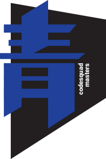

# 
# Tree
CodeSquad Master
Hoyoung Jung

---
<!-- page_number: true -->
---
# 트리 
https://visualgo.net/ko/bst

---
# 자주 사용하는 용어들
- 이진 트리
- 이진 순회 트리 
- 균형트리 / 불균형 트리
- 완전이진트리 
- **순회**
- AVL 트리, 레드블랙 트리 
- 트라이

---
# 구현하기 
```
```
---
# 