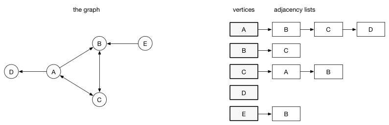
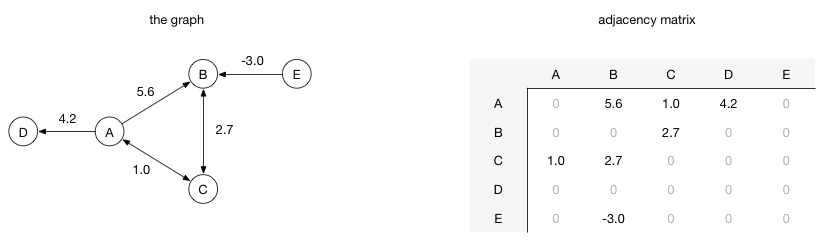
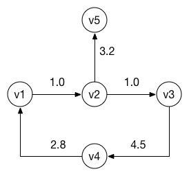

# 
# Graph
CodeSquad Master
Hoyoung Jung

---
# 그래프
https://en.wikipedia.org/wiki/Graph_(discrete_mathematics)

---
# 트리는 특별한 형태의 그래프 
- 순환이 없다. 
- 방향이 있다. 
- 자식은 반드시 하나의 부모만 갖는다. 

---

# tree vs graph

| tree        | graph   |
| ----------- | ------- |
| node        | vertex  |
| link        | edge    |
| root, child | 그런 거 없다 |
|방향이 항상 있음 | 있을 때도 있고 없을 때도 있음

---
# 그래프의 모드

vertex와 edge외에 추가적으로 방향(direction)과 가중치(weight)를 가질 수 있다. 

> U / U 
> U / W
> D / U
> D / W

---
# 그래프의 표현

https://visualgo.net/en/graphds 참조

- Adjacency Matrix
- Adjacency List

List가 적합한 경우가 많다. 

---
# Adjacency list



---
# Adjacency matrix



---
# 그래프 비교 

| Operation       | Adjacency List | Adjacency Matrix |
| --------------- | -------------- | ---------------- |
| Storage Space   | O(V + E)       | $O(V^2)$         |
| Add Vertex      | O(1)           | $O(V^2)$         |
| Add Edge        | O(1)           | O(1)             |
| Check Adjacency | O(V)           | O(1)             |
---
# 그래프 API 
```javascript
number_vertex()
number_edge()
insertVertex(vertex)
existEdge(i, j)
insertEdge(edge)
removeEdge(i, j)
```

---
# 그래프 구현하기 



https://gist.github.com/honux77/043921363037b4bc5b635bb1871496b0

---
# 그래프 순회

트리 순회보다 어렵다.
방문 체크를 하지 않으면 무한 루프에 빠질 수도 있다. 

---
# 깊이 우선 탐색 - Depth First Search

조금 쉬운 편 

전체를 방문하고 싶을 때 사용 

스택을 사용해서 구현할 수도 있다.

트리 순회는 전부 DFS 유사품이라고 볼 수 있다.

---
# DFS
```
search(vertex) {
    if (vertex == null) 
        return;
    visit(vertex);
    vertex.visited = true;
    for (v in vertex.adjacent) {
    	if (v.visited == false) {
            search(v)
         }
    }
```

---
# 넓이 우선 탐색 - BFS

queue가 하나 필요하다. 

인접 이웃을 먼저 다 방문하고 나서 다음 vertex를 방문하는 방법 

---
# BFS

```
search(vertex) {
    q = new Queue();
    vertex.visited = true;
    visit(vertex);
    
    q.enqueue(vertex);
    while(!q.isEmpty()) {
        v = q.deque()
        for (v2 in v.adjacent) {
            if (v2.visited == false) {
                visit(v2);
                v2.visited = true;
                queue.enqueue(v2);
             }
         }
     }
```
---
# 구현 예제

https://gist.github.com/honux77/16ec3ec4df3252028349470738081fc9

---
# 잠깐! 

BST에서 높이별로 출력하려면? 

---
# 참고자료

- 코딩인터뷰 완전분석
- Swift Algorithm Club 
- 자료구조 및 알고리즘 C++