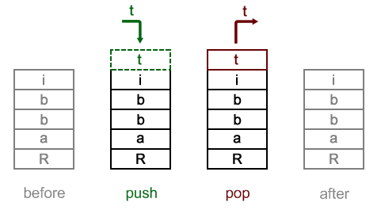
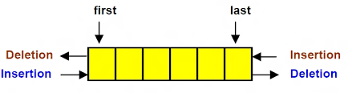

#  
# 더블 링크드 리스트와 Deque 
CodeSquad Master 
Hoyoung Jung

---
<!-- page_number: true -->
# 스택(Stack)



---
# Stack 
Last In, First Out

```
Stack create()
boolean isEmpty()
push(Object o)
peek()
pop()
```
---
# 큐(Queue)
First In, First Out

---
# deque (덱)

stack + queue

편리하니까 종종 사용됨 



이걸 구현하려면 어떻게 할까요?

---
# doubly linked list

```java
LinkedList<String>l = new LinkedList<String>();
l.addFirst("hello");
l.addLast("world");
for(String s: l) {
	System.out.println(s);
    
System.out.printf("%s %s\n", l.removeFirst(), l.removeLast());
System.out.println(l.isEmpty());
```

---
# Double Linked List Implementation

내부적으로 head와 tail 변수 필요 
```
addFirst(item)
addLast(item)
add(index, item)
get(index)
remove(index)
removeFirst()
removeLast()
size()
```

---
# 구현하기 

https://gist.github.com/honux77/c8d8b0cff181546cd19927a904180146


---
# 알고리즘 문제 

$$a_1,a_2,..,a_n,b_1,b_2,..,b_n$$

를 다음과 같이 바꾸려고 한다. 

$$a_1,b_1,a_2,b_2,...$$

갯수를 모른다고 할 때 이걸 푸는 방법은? 
- 제일 쉬운 방법부터 제시
- 대화를 하면서 개선하기 

---
## runner 를 적용하자.

부가적인 변수를 사용하고 달리는 속도를 다르게 해서 문제를 푸는 방범

```java
n1 = n2 = list.head;
while(n2 != null) {
n1 = n1.next;
n2 = n2.next.next;
//...
}
```

https://gist.github.com/honux77/fc7127503a194d11ff7c8abb2d5092cf

---
# 참고자료

코딩 인터뷰 완전분석

Introduction to algorithm

Data structure and Algorithms in C++

http://www.algolist.net/Data_structures/Stack
