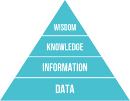

#  
# DBMS는 왜 사용하나요?

CodeSquad Master  
Hoyoung Jung

---
<!-- page_number: true -->
# Data, Database, and DBMS?

# Data, Information, Knowledge, Wisdom?

https://en.wikipedia.org/wiki/DIKW_pyramid

---
<!-- page_number: true -->
# RDMBS
Relational Database Management System?

E.F. Codd, "A Relational Model of Data for Large Shared Data Banks"
- IBM System R 
- Berkeley Postgres

---
<!-- page_number: true -->
# SQL
- Structured Query Language 
- 선언적 언어 cf. 절차적 언어
- RDMBS 제어에 사용됨

## 관계형 데이터베이스 
- Oracle, MySQL, MS-SQL, PostgreSQL, ...

---
<!-- paœge_number: true -->
# NOSQL
- Not Only SQL
- 관계형 데이터베이스가 아닌 나머지
- 그래프 디비, 도큐먼트 디비, KV Store
- MongoDB, Redis, DyanmoDB, neo4j, Casandra, HBASE, ...

---
<!-- paœge_number: true -->
# 데이터베이스 관련 용어
## CAP
- Consistency, Availability, Partition Tolerence
## ACID
- Atomicity, Consistency, Isolation, Durability
## 확장성
- 수평 확장 VS 수직 확장 

---
<!-- paœge_number: true -->
# SQL VS NoSQL
## CAP?
## ACID?
## Transaction?
## 확장성?
http://db-engines.com/en/ranking

---
<!-- paœge_number: true -->
# Graph DB  
## Neo4j
https://neo4j.com/why-graph-databases/

- 복잡한 관계 처리 지원
- 친구 추천 알고리즘, SNS 등에 적합

---
<!-- paœge_number: true -->
# Document DB
## MongoDB
https://www.mongodb.com/
- json 기반 레코드 저장
- 아무거나 막 저장
- 비교적 빠르고 사용이 간단하다.

### 단점 
- 조인에 부적합
- 이전 버전의 경우 쓰기 성능에 문제가 있음

---
<!-- paœge_number: true -->
# Key-Value DB 
## Redis, Mem-cached
- 엄청 빠르다.
- 단순 데이터 처리
- 캐시 / 데이터 분산용 

---
<!-- paœge_number: true -->
# Cloud DB
## Amazon DynamoDB
## Google Firebase
## Realm

- KV Store + Document Store 등 다양한 기능
- 설치가 필요없음
- 사용이 쉽고 편리한 편
- 고성능, 고가용성, 내구도 
- 저렴하지 않은 비용(?)

---
<!-- paœge_number: true -->
# ETC
## Hadoop Eco System 
 - HBASE, Spark, ...
## Cassandra
## Elastic Search 

---
# Thank You!

