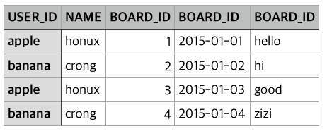

#  
# :crown: 간단 조인 
<p align='center'>
CodeSquad Master <br>
Hoyoung Jung
</p>

---
# 실습 
아래 내용으로 테이블을 만들어 봅시다.


---
https://github.com/code-squad/blue-common/blob/master/dbms/scripts/join_basic.sql
```
DROP TABLE IF EXISTS USER;
CREATE TABLE USER (
	ID VARCHAR(32),
	NAME VARCHAR(32) NOT NULL,
	PRIMARY KEY(ID)
	);

INSERT INTO USER VALUES 
('apple', 'honux'),('banana','crong'),('carrot','pobi');

DESC USER;
SELECT * FROM USER;
```
---
```
DROP TABLE IF EXISTS BOARD;
CREATE TABLE BOARD(
	ID INT NOT NULL AUTO_INCREMENT,
	DATE DATE,
	UID VARCHAR(32),
	TITLE VARCHAR(64) NOT NULL,
	PRIMARY KEY(ID));	

INSERT INTO BOARD (DATE, UID, TITLE) VALUES 
	('2015-1-1','apple', 'hello'), 
	('2015-1-2','banana', 'hi'), 
	('2015-1-3','apple', 'good'), 
	('2015-1-4','banana', 'zizi'), 
	('2015-1-3',NULL, 'I am hacker');
    
DESC BOARD;
	
SELECT * FROM BOARD; 
```

---
# Join 

두 테이블을 결합해서 의미있는 데이터를 보여주는 쿼리 

```
SELECT * FROM USER U JOIN BOARD B ON U.ID = B.UID;
```

`SELECT *`보다는 의미있는 컬럼만 출력하는 것이 더 좋습니다. 
```
SELECT U.ID AS USER_ID, NAME, 
	B.ID AS BOARD_ID, DATE, TITLE
    FROM USER U JOIN BOARD B 
    ON U.ID = B.UID;
```

---
# Join
## 실행 결과
