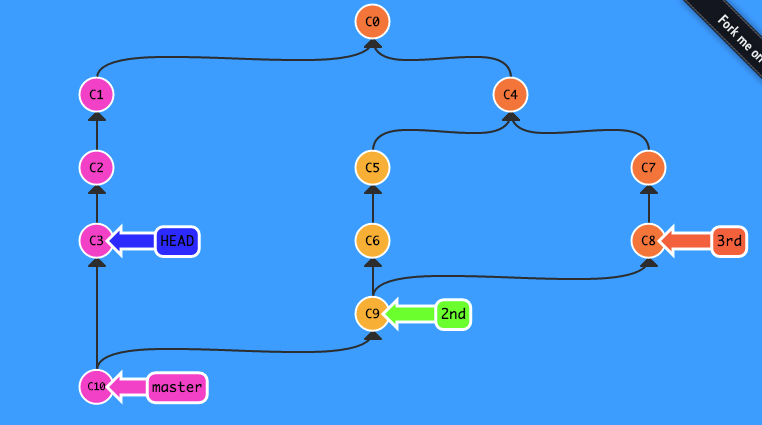

#  
# Git Review, Tips, and FAQ
#### CodeSquad Master 
#### Hoyoung Jung

---
<!-- page_number: true -->
# 오늘의 팁: TIL
https://milooy.wordpress.com/2015/10/08/daily-commit/

## 의도적 TIL 
- developed by me
- 아주 긴 시간을 목표로 잡는다. 
- 안 하는 날도 있을 수 있다. 
- 못하면 진도를 누적하지 않는다. 
- 미션을 주고 달성하도록 노력한다. 

---
# Git Review 
## 저장소 
- 작업 디렉토리
- 인덱스
- 로컬 저장소
- 원격 저장소

---


http://uclouvain.github.io/osis-louvain-documentation/doc/development/images/git-state-diagram.png

---
## 프로젝트 생성 

> git init .
> git clone 원본저장소 [디렉토리이름]

- 로컬저장소도 원본저장소가 될 수 있음

---
## 프로젝트 설정

> git config --global --list
> git config --global 변수명
> git config --global 변수명 값
> git config 변수명 값 #로컬 설정 
> cat .git/config #로컬 설정 파일 

## 단축명령 만들기 
> git config --global alias.co commit
> git co # = git commit 

- shell alias 명령과의 조합으로도 사용 가능 

---
## git add

> git add . 
> git add --all # .과의 차이는?
> git add somedir/*

---
## git commit

> git commit 
> git commit -m "Add some file"
> git commit 파일명 -m "Add other file"

--- 
## branch 
> git branch 브랜치이름 [커밋]
> git checkout 브랜치이름 
> git checkout -b 새브랜치이름 [커밋]
> git branch -f 브랜치이름 커밋 

---
# 실습
http://learngitbranching.js.org/?NODEMO


---
## 참조
> HEAD
> HEAD^1
> HEAD~1
> **branch_name** #가장 많이 사용
> tag_name
> 7fdc #커밋번호 

---
## HEAD, HEAD^, HEAD~
```
G   H   I   J (부모 = 오래된 커밋)
 \ /     \ /
  D   E   F
   \  |  / \
    \ | /   |
     \|/    |
      B     C
       \   /
        \ /
         A (자손 = 최신 커밋)

A =      = A^0
B = A^   = A^1     = A~1
C = A^2  = A^2
D = A^^  = A^1^1   = A~2
E = B^2  = A^^2
F = B^3  = A^^3
G = A^^^ = A^1^1^1 = A~3
H = D^2  = B^^2    = A^^^2  = A~2^2
I = F^   = B^3^    = A^^3^
J = F^2  = B^3^2   = A^^3^2
```
---
## branch 합치기
```
> git merge 참조 
> git rebase 참조
> git cherry-pick 참조 
```

---
## 되돌리기 
```
> git revert 
> git reset --hard HEAD~2
> git branch -f master 커밋번호
```

---
## commit 수정하기
> git rebase -i HEAD~3
```
pick
edit
reward
squash
```
---
## 원격 저장소 설정

> git remote add origin 원격저장소주소
> git remote add second 다른저장소주소
> git remote -v 

---
## git push
> git push -u origin master 
> git push --set-upstream origin master
> git push --force #협업시 금지 명령 
> git push --delete 브랜치이름 #원격 브랜치 제거 

---
# FAQ

작업 디렉토리에는 남겨 넣고 인덱스에서만 변경 내용을 제거하고 싶습니다.

> git rm --cached

방금 전에 커밋했는데 실수를 발견했어요. 약간만 고쳐서 커밋에 추가하고 싶은데 가능한가요?

> git commit --amend 

---
# FAQ 2

민감한 파일을 git history에서 완전히 지우고 싶어요. 

> brew install bfg
> bfg --delete-files password.txt
> git push --force

https://help.github.com/articles/removing-sensitive-data-from-a-repository/

---
# FAQ 3

git이 정상동작하지 않아요. 긴 시간 작업한 내용이 커밋이 안 됩니다. 살려 주세요 :angry: 
```
cd gitdir
rm -rf .git* 
cd ..
git clone http://remote/mygit gitdir2
cp -a gitdir gitdir2
cd gitdir2
# ... add, commit, push 
```
---
# 참고자료
- https://help.github.com/articles/removing-sensitive-data-from-a-repository/