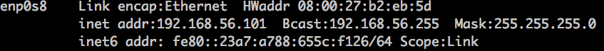

#  
# 리눅스로 서버 배포 경험하기 
<p align='center'>
CodeSquad Master <br>
Hoyoung Jung
</p>

---
<!-- page_number: true -->
# 사전 요구 사항
- 리눅스 명령어 기본 
- 가상머신을 이용한 리눅스 설치 

---
# 오늘 하는 것 
- 가상 머신에 접속하기
- 내 백엔드 서비스 띄우기 
- 로컬 PC에서 접속해 보기

---
## 내 서비스를 로컬 PC에서 돌려보자
정상동작 확인 후 다음단계로 

---
## 프로젝트를 github에 업로드하기 
불필요한 파일은 가급적이면 업로드하지 않는다.

중요파일은 절대 업로드하지 않는다.

기업/ 영리 목적의 프로젝트 경우는 비공개 프로젝트를 사용하는 경우가 많다.

---
## 서버에 접속하기

터미널(맥), putty(윈도우) 등을 이용해서 가상서버에 접속한다.

가상서버 아이피를 알아야 접속 가능 
```
$ ssh myid@serverip
```
---
## 체크포인트

가상서버에 호스트 전용 네트워크를 연결해 놓으면 접속하기가 더 쉽다.
```
$ ifconfig #linux에서 실행 
```
 

---
## 서비스에 필요한 프로그램들을 설치

lubuntu는 ubuntu 계열이므로 apt를 이용 설치 가능 
google로 검색을 해 보고 설치하자. 

> git, mysql, node, kitura, ... 등 

```
$ sudo apt install git 
$ sudo apt install vim-nox
$ sudo apt install tmux
```
---

## github로부터 소스 가져오기

평소에 하던 방식대로 소스를 clone해 온다. 

## 돌아가게 만들기
node, swift 패키지를 설치해서 서버에서 내 프로젝트가 돌아갈 수 있게 구성한다. 

맥의 브라우져를 통해서 확인하기 

##  참고 링크

https://nodejs.org/ko/download/package-manager/#debian-ubuntu-linux

http://www.kitura.io/en/starter/settingup.html

---
## ngrok 활용해서 외부 접속하기

https://ngrok.com/ 

리눅스에서 다운받아서 실행 
```
$ ngrok http 포트번호
```
명령창 url로 접속 

---
## 돌아가게 만들기 2

웹브라우져 등의 클라이언트 프로그램을 통해서 정상 동작 확인하기

SSH창을 닫아도 서비스가 동작하게 하려면?

서버가 죽었을 때 자동으로 동작하게 하려면?

재부팅했을 경우에도 서비스가 정상 동작하도록 만들기 