<!-- page_number: true -->
#  
# OS Basic Concepts
CodeSquad Master 
Hoyoung Jung

---
<!-- page_number: true -->

# 10진수 2진수 8진수 16진수

- Decimal
- Binary
- Haxa-decimal
- Octal 
---
# 각각 변환은 어떻게?

- 10 <--> 2, 8, 16 
- 2 <--> 16

---
# 추상적인 컴퓨터 구조
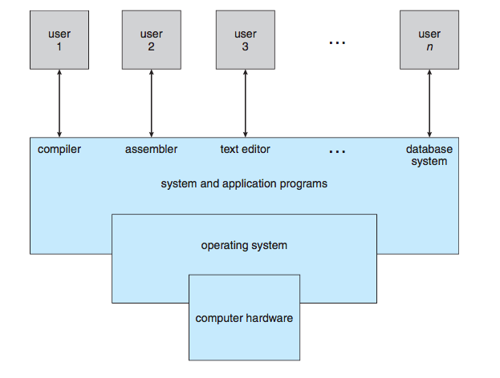

---
# 하드웨어의 구성 요소
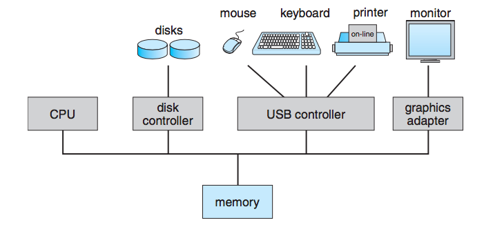

---
# 인터럽트란? 
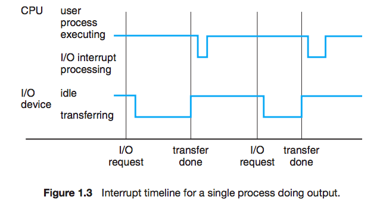

---
# 메모리 계층 구조
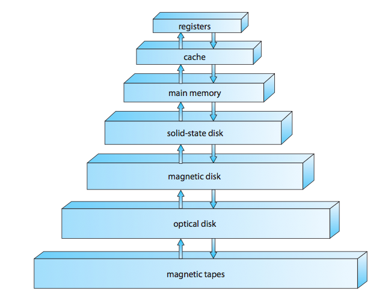

---
# computer 
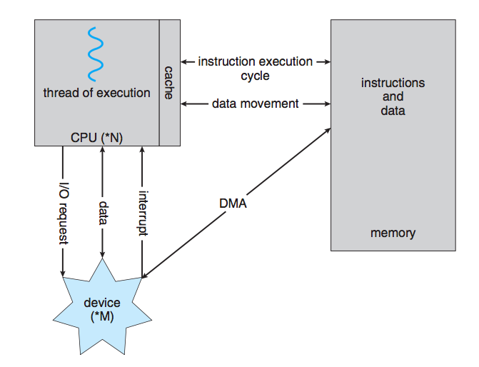

---
# computer 2
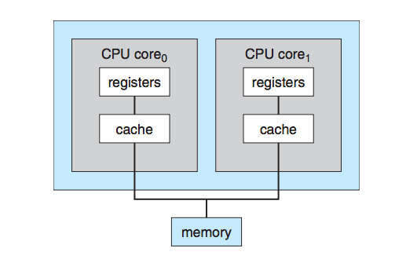

---
# 분산 컴퓨팅
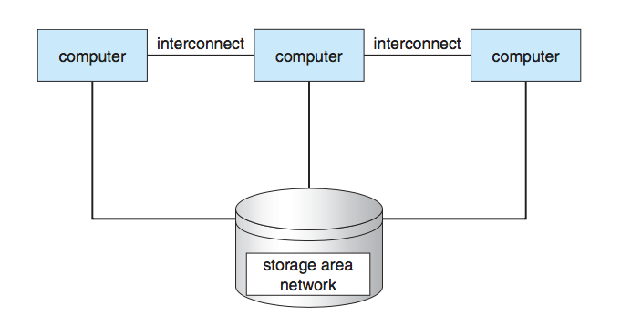

---
# 메모리 추상화
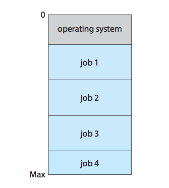

---
# 가상화
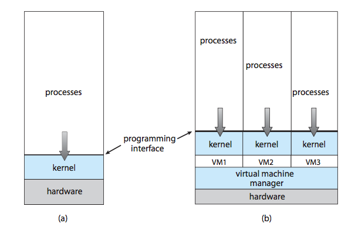

---
# MS-DOS
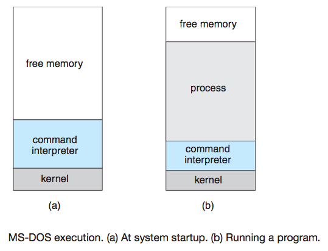

---
# FreeBSD
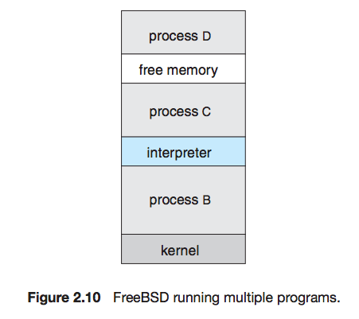

---
# 운영체제에서 사용하는 자료구조
- 링크드 리스트 
- 해시맵
- 균형 트리
- **비트맵**

---
# 프로세스
- 실행 중인 프로그램
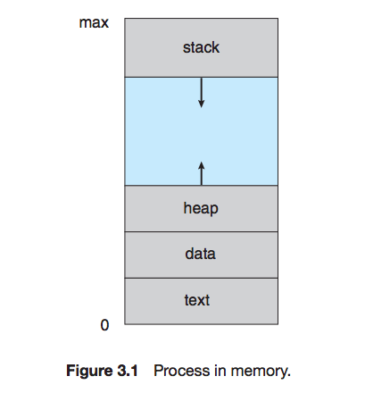

---
# 프로세스의 상태 다이어그램
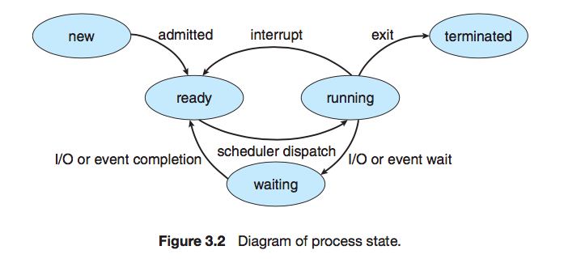

---
# Process Control Block
프로세스가 포함하고 있는 중요한 정보들
살아있는 동안만 유지된다.
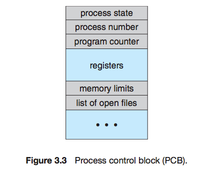

---
# Linux: task_struct
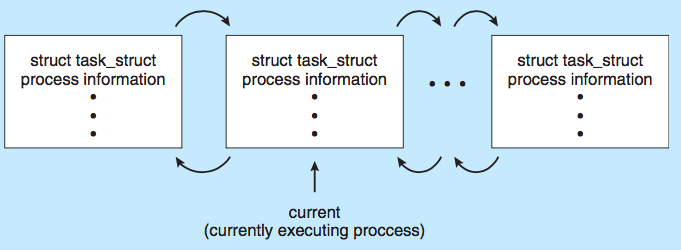

---
# Linux: task_struct
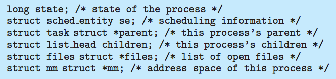

---
# 컨텍스트 스위치
- 한 프로세스에서 다른 프로세스로 작업을 변경하는 것 
- 어떤 정보를 저장해야 하는가? 

---
# Context Switch
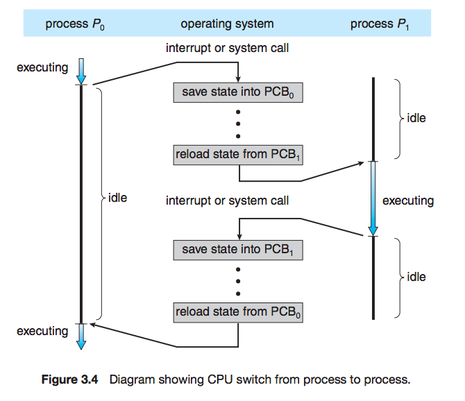

---
# 프로세스가 생기는 절차.
1. fork()라는 시스템콜을 수행하면 새로운 프로세스가 생겨난다.
2. 새로운 자식 프로세스는 부모의 클론이다.
3. exec()라는 시스템콜이 프로세스를 원하는 모양으로 변신시킨다.
4. 실행된다.

---
# 일반적인 프로세스의 라이프사이클 
1. 운영체제 생성시 1번 프로세스가 생김
2. 1번 프로세스는 여러 자식을 만들어서 다양한 일을 함 
3. 여러 종류의 프로세스가 백그라운드에서 계속 실행중 

---
# 우리가 셸(bash)을 실행하면
1. 정해진 어떤 프로세스가 fork() 함
2. 자식 프로세스에서 exec(bash)를 해서 bash가 됨

---
# 우리가 bash에서 명령어를 실행시키면 
1. bash가 자신을 fork()함 
2. 자식 프로세스는 exec(comand)함 
3. 자식이 일을 하고 값 리턴 후 종료
> $ echo $? 로 값 확인 가능 
> 0 : 정상 종료
> 그 외 : 비정상 종료
4. 자식 프로세스는 PCB의 일부를 남김
5. 부모 프로세스는 자식 프로세스를 잘 정리함 

:question: 자식 프로세스보다 부모가 먼저 죽으면?

---
# 다음 시간에는

커널이란 무엇인가
유저 모드와 커널 모드
시스템 콜을 배워 봅시다.

---
# 참고 자료 
