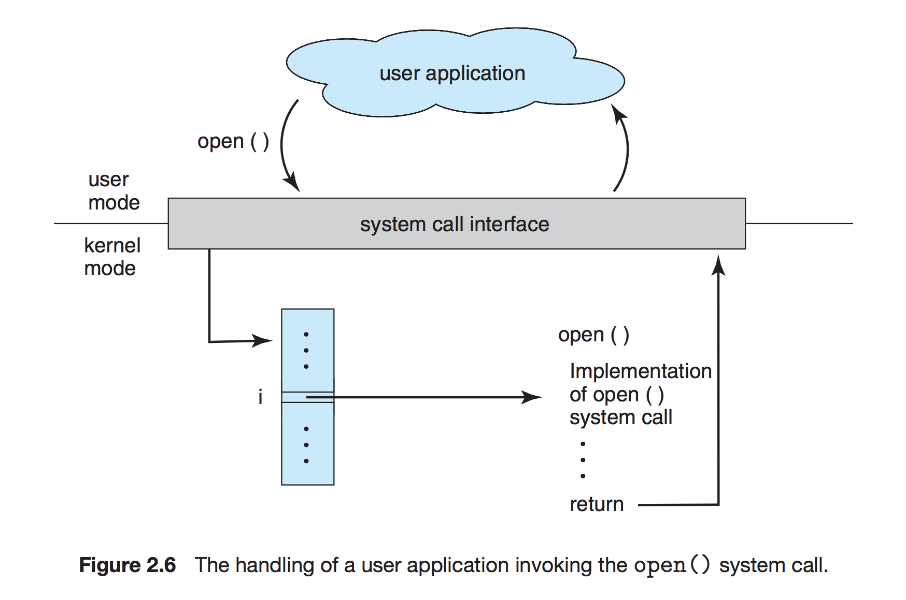
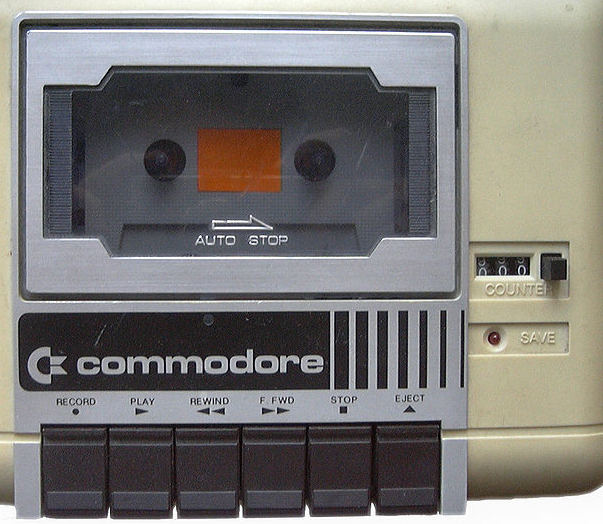

<!-- page_number: true -->
#  
# File IO
CodeSquad Master 
Hoyoung Jung


---
<!-- page_number: true -->

# 운영체제의 모드

- 유저 모드: 일반적인 프로세스는 유저 모드에서 동작 
- 커널 모드: 유저 모드에서 시스템 콜을 호출하면 커널 모드에서 실행됨 
    - 하드웨어 제어
    - 파일 입출력과 같은 IO 작업

---
# API
Application Programming Interface
- 운영체제나 프로그램 언어에서 제공하는 기능을 코딩을 통해 사용할 수 있게 해 줌 
- 계약(X) 통지(O)

### cf) GUI: Graphic User Interface

---
# 시스템 콜 
- 운영체제의 기능을 직접적으로 이용하기 위해 만들어진 기능 
- C, C++, 어셈블리 등을 이용해 호출 가능 

> 파일 읽기: open, read, write, lseek
> 프로세스 생성: fork, exec, kill
> 메모리 관리: brk, mmap
> 하드웨어 제어: ioctl

---
# 시스템 콜의 동작


---
# 파일 IO

파일 읽기 쓰기는 카세트 테이프처럼 동작합니다.



---
# 파일 IO가 중요한 이유
유닉스는 OS 안의 모든 객체를 파일로 간주합니다.
네트워크와 다른 IO 조작도 파일 조작과 거의 유사합니다.

--- 
# 스트림이란
시냇물이라는 뜻.
파일을 열면 스트림 객체가 반환됩니다. 
이 스트림 객체를 통해서 읽기, 쓰기, 검색이 가능해 집니다.

---
# 파일 IO 관련 API
## FILE 객체 기반 
- 열기
- 닫기 
## 스트림 기반 
- 읽기 
- 쓰기
- 검색

---
# C언어 시스템콜로 파일 읽기
https://github.com/code-squad/blue-common/blob/master/os-linux/codes/read.c

---
```
#include <sys/types.h>
#include <sys/stat.h>
#include <fcntl.h>
#include <unistd.h>
#include <stdio.h>
 
int main(void) {
	const int len = 64;
	ssize_t ret;
	int fd = open("read.c", O_RDONLY);
	char buf[len];
	while ((ret = read(fd, buf, len)) != 0) {
		write(STDOUT_FILENO, buf, ret);
		//write(1, buf, ret);
	}
	close(fd);
	return 0;
}

```
---
# STDIN, STDOUT, STDERR

각각 열린 파일 0번, 1번, 2번
표준입력 - 키보드
표준출력 - 콘솔 화면
표준에러 - 콘솔 화면 

---
# Java File IO 예제
- BufferedReader, Writer
- Scanner, PrintWriter

https://github.com/code-squad/blue-common/blob/master/codes/src/codesquad/FileIOExample.java

---
# NodeJS file IO
동기 방식과 비동기 방식이 존재함
http://mudchobo.tistory.com/542
```
var fs = require('fs');

var data = fs.readFileSync('hello.txt', 'utf-8');
console.log(data);
```
---
# Swift file IO

>import Foundation
>
>let text = try?String(contentsOfFile: "hello.txt", encoding: String.Encoding.utf8)
>
>print(text!)

---
# 과제
주소록에 파일 저장 기능을 추가해 봅시다.

---
# 더 공부해 볼 것
Linux - select 와 epoll
Window - IOCP
Java - NIO, NIO2

---
# 참고 자료 
Operating System Concepts, 9th Edition
Linux System Programming
